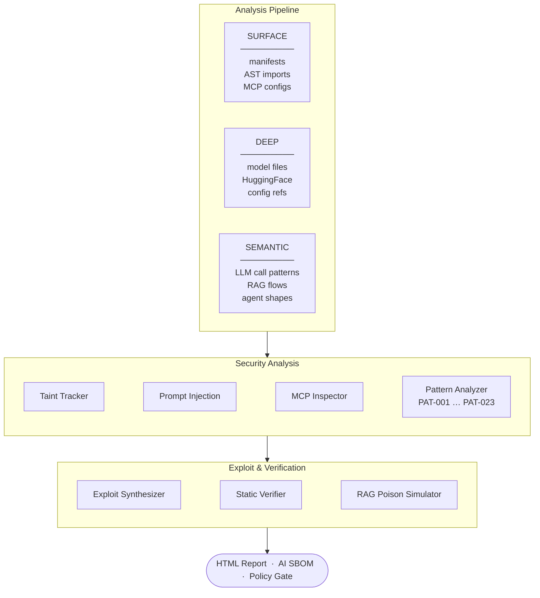

# AITrace — Attack Path Analysis and Exploit Synthesis for AI Applications

Traces user-controlled data through AI framework call chains across files and generates working exploit payloads from confirmed attack paths. Static analysis — no running application needed.

Supports LangChain · LangGraph · AutoGen · CrewAI · Semantic Kernel · LlamaIndex · Haystack · RAG pipelines · MCP servers · OpenAI / Anthropic / Cohere / Vertex AI SDKs · ChromaDB · Pinecone · FAISS and more.

---

## What it does

- **Traces attack paths** — Follows user input, env vars, and external data through AI framework calls across modules (not single-file grep)
- **Confirms reachability** — Cross-file call-graph analysis marks which paths actually reach LLM, agent, code-exec, or SQL sinks
- **Synthesizes exploits** — With `--exploit`, emits codebase-specific PoC payloads aimed at confirmed sinks, plus static CONFIRMED / LIKELY / UNCERTAIN verdicts
- **Surfaces AI stack context** — Inventories LLM SDKs, agents, RAG, vector stores, and MCP configs so the path has a clear target map
- **One HTML report** — Walk findings and (optional) exploit payloads in the browser after each run

Optional: CycloneDX / SPDX AI BOM and Mermaid architecture diagram via `-f`.

---

## Installation

**Requirements:** Python 3.9+ · No telemetry · Core analysis makes no external API calls

```bash
# Recommended
pipx install aitrace-cli
# or
uv tool install aitrace-cli

aitrace --help
```

From source:

```bash
git clone https://github.com/alishasinghania/AITrace-cli
cd AITrace-cli
pip install -e .
```

---

## Usage

```bash
# Scan a local repo — writes aitrace-report.html and opens it
aitrace scan ./my-app

# Scan a remote GitHub repo directly (shallow clone, no setup needed)
aitrace scan https://github.com/owner/repo
aitrace scan https://github.com/owner/repo --exploit

# Generate PoC payloads from confirmed paths (+ RAG poison docs when RAG detected)
aitrace scan ./my-app --exploit

# Headless / CI — no browser
aitrace scan ./my-app --no-open

# Write to a specific directory
aitrace scan ./my-app -o ./results

# Optional machine-readable outputs
aitrace scan ./my-app -f cyclonedx -f spdx -f mermaid

# Policy gate — exits code 1 on violation (use in CI)
aitrace scan ./my-app --policy policy.yaml --no-open

# Write findings JSON + architecture graph
aitrace scan ./my-app --verbose
```

---

## Output files

By default, all files are written into the **scanned repository root**. Use `-o` / `--out-dir` to choose another directory.

| File | When |
|------|------|
| `aitrace-report.html` | Always (primary deliverable) |
| `aitrace-exploits.json` | `--exploit` |
| `aitrace-rag-poison-payload.txt` | `--exploit` + RAG detected |
| `aitrace-cyclonedx.json` | `-f cyclonedx` |
| `aitrace-spdx.json` | `-f spdx` |
| `aitrace-component-diagram.mmd` | `-f mermaid` |
| `aitrace-risk-report.md` | `-f risk-md` |
| `aitrace-findings.json` · arch graph | `--verbose` |

---

## How it works



1. **Discovery** — Inventories AI packages, agent frameworks, vector stores, MCP servers, and model artifacts from manifests and imports.
2. **Path analysis** — Builds a cross-file call graph, traces user-controlled data (routes, env vars, files) to LLM / exec / SQL sinks, and checks 23 structural vulnerability patterns.
3. **Exploit synthesis** (`--exploit`) — Generates codebase-specific PoC payloads for confirmed paths with CONFIRMED / LIKELY / UNCERTAIN verdicts. Includes RAG poison documents for detected vector stores.
4. **Report** — Single `aitrace-report.html` with grouped findings, MCP analysis, exploit gate, and architecture diagram.

---

## Policy gate

Optional governance check for CI — not a substitute for path analysis:

```bash
aitrace init-policy
aitrace scan . --policy policy.yaml --no-open
```

Exit code `1` on violation. Example GitHub Actions step:

```yaml
- name: AITrace policy gate
  run: aitrace scan . --policy policy.yaml --no-open
```
